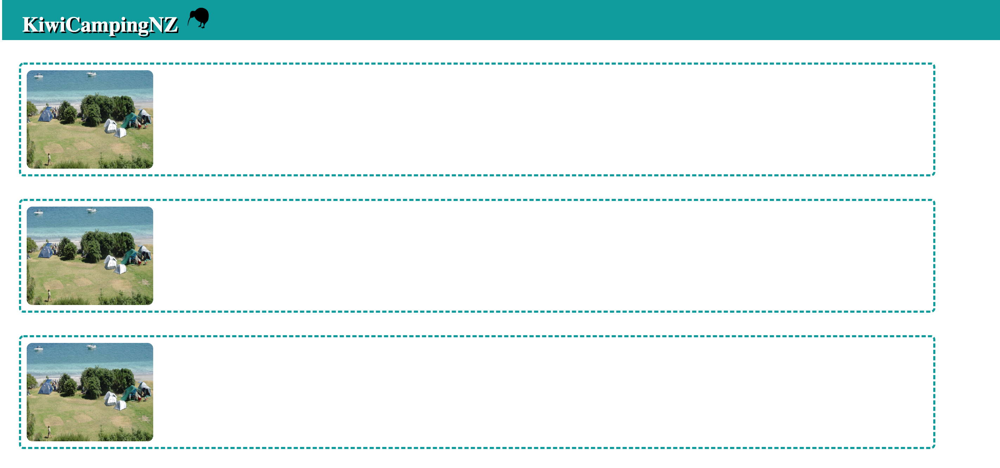

# KiwiCampingNZ

This is my personal project that I am currently working on.

* MVP (Minimun Vaiable Project)

It will display a list of campsites in New Zealand in an easy way, where the user can see a picture of the campsite, name, address and the facilities: displayed as icons. It will also have a link to the original website and a review section.

On the review section the user will be able to write comments and read other users' comments.

As MVP I will start with a list of 5 Campsites with the intetion to have all campsites in New Zealand.

* Stretch

1. Be able to include a list of all campsites in New Zealand.
2. Have a booking section.
3. Display the icons of the campsites on google maps.
4. Review's Section - to include the stars' rating according to users' opinion.

## Technologies 

React, APIs, HTML, CSS and Javascript

## Under construction

